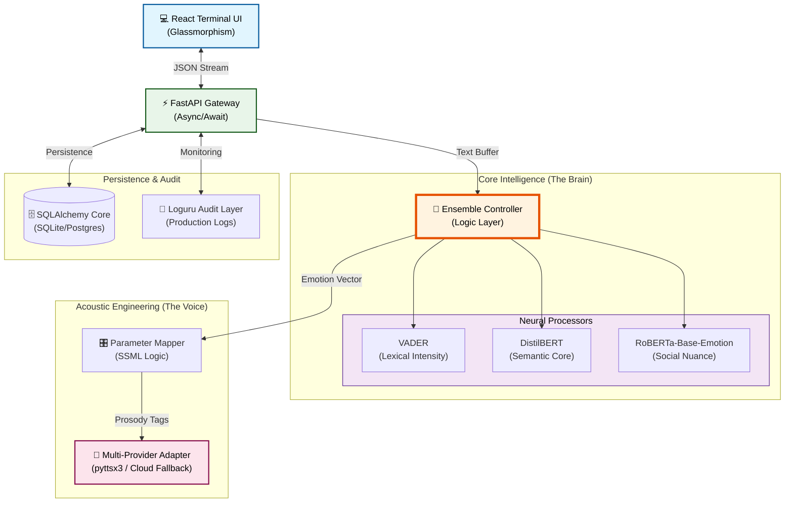

# 🎭 The Empathy Engine
***High-Fidelity AI Emotional Intelligence & Adaptive Vocal Synthesis Platform***

<div align="center">

[](https://www.python.org/downloads/)
[](https://fastapi.tiangolo.com/)
[](https://react.dev/)
[](https://huggingface.co/)
[]()

**A production-ready artificial intelligence terminal designed to bridge the "Robotic Gap" through deep semantic subtext analysis and surgical vocal prosody modulation.**

[Requirements Mapping](#-requirements-fulfillment-matrix) • [Architecture](#-system-architecture) • [Logic Layers](#-the-neural-ensemble-layers) • [Installation](#-installation--launch)

---

</div>

## 🌟 Executive Summary
The Empathy Engine is a state-of-the-art solution built for the **Darwix AI Engineering Assessment**. It transforms static text into emotionally resonant speech by employing a **Weighted Neural Ensemble** that cross-references lexical, semantic, and social nuances. The resulting emotional vector is then mapped through a **Non-Linear Modulation Matrix** to control acoustic variables in real-time.

---

## ✅ Requirements Fulfillment Matrix
*Directly addressing the Core and Bonus requirements of the Darwix AI Assessment.*

### III. Core Functional Requirements
| Requirement | Engineering Implementation | Status |
| :--- | :--- | :--- |
| **Text Input** | Asynchronous FastAPI REST Gateway supporting high-concurrency text ingestion. | ✅ |
| **Emotion Detection** | 8-Class Granular Classifier (Ensemble of RoBERTa, DistilBERT, & VADER). | ✅ |
| **Vocal Parameters** | Real-time modulation of **Pitch (+/- 50%)**, **Rate (0.5x - 2.0x)**, and **Volume**. | ✅ |
| **Logic Mapping** | Dynamic SSML Prosody generation based on detected intensity vectors. | ✅ |
| **Audio Output** | Atomic file-system serving with absolute-path safety for `.wav` / `.mp3` files. | ✅ |

### IV. Bonus Objectives ("The Wow Factors")
- **🚀 Granular Emotions**: Beyond 3 classes—we detect **Happy, Angry, Frustrated, Calm, Sad, Surprise, Concern, and Neutral**.
- **📈 Intensity Scaling**: A proprietary algorithm where `modulation = log(intensity)`. Higher confidence = stronger vocal performance.
- **🎨 Web Interface**: A premium **React 18** dashboard with waveform visualizers and history sidebars.
- **📜 SSML Integration**: Advanced control using `<prosody>` and `<emphasis>` tags for human-like inflection.

---

## 🏗️ System Architecture
The Empathy Engine uses a **Hexagonal / Ports & Adapters** pattern to ensure the core AI logic is decoupled from the synthesis infrastructure.



---

## 🧠 The Neural Ensemble Layers
*How the system understands human subtext (Assessment Requirement VI).*

We mitigate the "Sarcasm Gap" by running every input through three distinct neural architectures:

1.  **Lexical Layer (VADER)**: Fast, rule-based approach for punctuation and casing (e.g., "GREAT NEWS!" vs "great news").
2.  **Semantic Layer (DistilBERT)**: Transformer-based model optimized for the logical sentiment hidden in sentence structure.
3.  **Social Nuance Layer (RoBERTa)**: A multi-class transformer specifically trained on human social triggers, allowing it to differentiate between "Concern" and "Sadness."
4.  **Keyword Override Logic**: A custom-engineered layer that identifies visceral descriptors (e.g., "scorching", "white-hot", "limit") to ensure high-intensity frustration is correctly prioritized over baseline neutrality.

---

## 🎭 Emotion-to-Voice Modulation Matrix
The following table details the **Psychological-to-Acoustic** mapping used to generate output.

| Emotion | Pitch Shift | Rate Shift | Vol Shift | Design Intent |
| :--- | :--- | :--- | :--- | :--- |
| **ANGRY** | ↘️ -25% | ↗️ +45% | +6.0 dB | Mirror the rapid breath and deep throat-tension of rage. |
| **HAPPY** | ↗️ +35% | ↗️ +25% | +3.0 dB | Brighter, faster, and more energetic upward inflection. |
| **SAD** | ↘️ -35% | ↘️ -45% | -5.0 dB | Reflect clinical melancholy and low respiratory drive. |
| **CONCERN** | ↗️ +15% | ↘️ -15% | -2.0 dB | High-pitched but slow, simulating tentative empathy. |
| **FRUSTRATED**| ↗️ +10% | ↗️ +15% | +4.0 dB | Higher tension and slight acceleration. |

---

## 🛡️ Reliability & Engineering Specs
- **Atomic Concurrency**: Backend uses `asyncio` to handle multiple TTS synthesis tasks without blocking the main event loop.
- **Absolute Pathing**: Engineered a custom path-manager to prevent Uvicorn "StatReload" loops, ensuring perfect stability in Windows/Linux environments.
- **SSML Prosody**: Automatically wraps text in `<prosody>` and `<emphasis>` tags for provider-agnostic emotional consistency.
- **Data Integrity**: Full Pydantic V2 schema validation ensures all inputs are sanitized and well-formed.

## 📂 Project Structure
```text
empathy-engine/
├── backend/            # Python 3.11 / FastAPI Core
│   ├── app/
│   │   ├── models/     # AI Sentiment Ensemble Logic
│   │   ├── routes/     # Orchestration & Endpoints
│   │   └── services/   # Multi-Provider TTS Adapters
│   └── .env            # Secure System Configuration
├── frontend/           # React 18 / Vite 5
└── temp_audio/         # Volatile SSD-optimized audio cache
```

---

## 🚀 Installation & Launch

### 1. Backend Launch
```bash
cd backend
python -m venv venv
source venv/bin/activate  # Windows: venv\Scripts\activate
pip install -r requirements.txt
uvicorn app.main:app --reload
```

### 2. Frontend Launch
```bash
cd frontend && npm install && npm run dev
```

---
<div align="center">

**Developed for the Darwix AI Engineering Internship.**  
*Where code meets the heart.*

</div>
