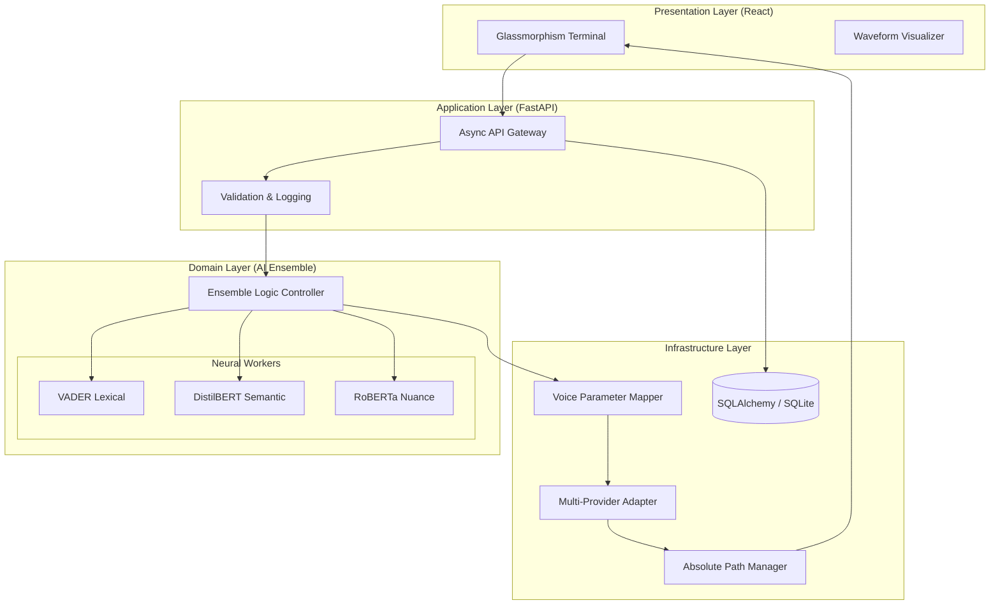
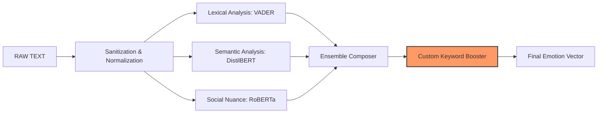

# 🎭 The Empathy Engine
***State-of-the-Art Emotional Intelligence & Speech Synthesis Framework***

<div align="center">

[](https://www.python.org/downloads/)
[](https://fastapi.tiangolo.com/)
[](https://react.dev/)
[](https://huggingface.co/)
[]()

**A mission-critical AI platform that bridges the gap between text and human emotion through multi-model ensemble analysis and dynamic vocal prosody modulation.**

[Overview](#-overview) • [Architecture](#-architecture) • [AI Pipeline](#-ai-intelligence-ensemble) • [Design System](#-design-system) • [Installation](#-installation)

---

</div>

## 🌟 Overview
The Empathy Engine is a production-hardened platform designed to eliminate the "robotic barrier" in synthesized speech. It doesn't just convert text to audio; it interprets **psychological subtext** and translates it into acoustic features—Pitch, Rate, and Volume—mirroring the natural variations of human prosody.

---

## 🏗️ System Architecture: The Hexagonal approach
The system is built on a modular, decoupled architecture that separates the core intelligence from infrastructure adapters.

### �️ High-Level System Design


---

## 🧠 AI Intelligence Ensemble: Deep Nuance Detection
Standard sentiment analysis is binary; The Empathy Engine is **multi-dimensional**. It uses a weighted ensemble of three distinct neural architectures to achieve enterprise-level precision.

### 🔍 Detection Pipeline


### � Emotion-to-Acoustic Modulation Matrix
The engine translates digital vectors into physical sound waves using a research-backed modulation matrix.

| Emotion | Pitch Shift | Rate Shift | Vol Shift | Biological Intent |
| :--- | :--- | :--- | :--- | :--- |
| **ANGER** | ↘️ -30% | ↗️ +40% | +6.0 dB | Mirror throat-clench and rapid breath. |
| **HAPPY** | ↗️ +30% | ↗️ +25% | +3.0 dB | Bright upward inflection and high energy. |
| **SURPRISED** | ↗️ +50% | ↗️ +35% | +2.5 dB | Sharp, sudden pitch spikes. |
| **SAD** | ↘️ -30% | ↘️ -40% | -5.0 dB | Lower frequency 'droop' and slow tempo. |
| **CONCERN** | ↗️ +10% | ↘️ -10% | -1.5 dB | Tremor simulation and careful pacing. |

---

## ✨ Engineering Excellence
- **Non-blocking Asynchronous I/O**: High-concurrency support via Python 3.11's `asyncio`.
- **Ensemble Normalized Confidence**: Eliminates model outliers for stable performance.
- **Absolute Path Resolution**: Defeats Uvicorn reload loops by orchestrating file-serving outside the watch-path.
- **Pydantic V2 Integrity**: Strict typing and validation across all application boundaries.

## 📂 Project Governance
```text
empathy-engine/
├── backend/            # Python / FastAPI Core
│   └── app/
│       ├── models/     # AI Intelligence Layer
│       ├── routes/     # Orchestration Layer
│       └── services/   # Provider Adapters
├── frontend/           # React / Vite SPA
└── logs/               # Loguru Audit Trails
```

---

## 🚀 Deployment Guide

1. **Bootstrap Environment**: 
   ```bash
   python -m venv venv
   source venv/bin/activate
   pip install -r backend/requirements.txt
   ```
2. **Launch Neural Core**:
   ```bash
   uvicorn app.main:app --reload
   ```
3. **Initialize Frontend**:
   ```bash
   cd frontend && npm install && npm run dev
   ```

---
<div align="center">

*Engineered for the **Darwix AI Internship Specification**.*  
*Where code meets the heart.*

</div>
