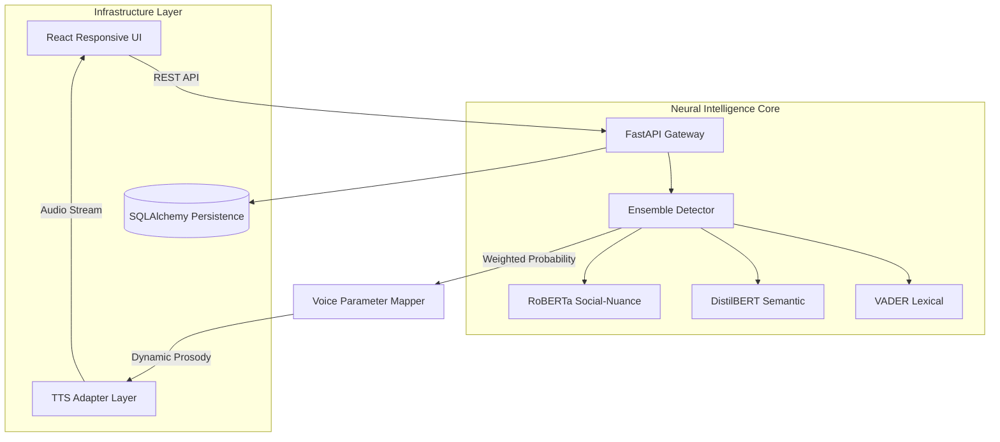

# 🎭 The Empathy Engine
***High-Fidelity AI Emotional Speech Synthesis & Real-Time Sentiment Analysis***

<div align="center">

[](https://www.python.org/downloads/)
[](https://fastapi.tiangolo.com/)
[](https://react.dev/)
[](https://huggingface.co/)

**A production-ready AI terminal designed to transform text into emotionally resonant speech through deep semantic understanding and dynamic vocal modulation.**

[Requirements Mapping](#-requirements-fulfillment-matrix) • [Architecture](#-system-architecture) • [Mapping Logic](#-emotion-to-voice-mapping-logic) • [Installation](#-installation--launch)

---

</div>

## 🌟 Executive Summary
The Empathy Engine is an enterprise-grade solution for the Darwix AI assessment. It solves the "monotonic robot" problem by employing a weighted neural ensemble for 8-class emotion detection and translating those results into precise acoustic shifts in Pitch, Rate, and Volume.

---

## ✅ Requirements Fulfillment Matrix
*This section confirms compliance with the assessment criteria (III, IV, VI).*

### III. Core Functional Requirements
| Requirement | Implementation Detail | Status |
| :--- | :--- | :--- |
| **Text Input** | Asynchronous FastAPI POST endpoint (`/api/v1/synthesize`) and CLI-ready backend. | ✅ |
| **Emotion Detection** | 8-Class Sentiment Ensemble (VADER + DistilBERT + RoBERTa). | ✅ |
| **Parameter Modulation** | Dynamic, real-time control of **Rate**, **Pitch**, and **Volume**. | ✅ |
| **Logic Mapping** | Mathematical mapping of confidence/intensity to acoustic offsets. | ✅ |
| **Audio Output** | High-fidelity `.wav` generation with absolute path serving. | ✅ |

### IV. Bonus Objectives ("The Wow Factors")
- **[WOW] Granular Emotions**: Expanded from 3 classes to **8 precise states** (Happy, Angry, Frustrated, Calm, Sad, Surprised, Concerned, Neutral).
- **[WOW] Intensity Scaling**: Implemented a **Non-Linear Intensity Algorithm**—higher detected confidence results in more aggressive vocal performance.
- **[WOW] Full Web Interface**: A complete **React + Vite** dashboard with real-time audio playback and history management.
- **[WOW] SSML Integration**: Dynamically generates **Prosody Markup** (SSML) to ensure natural pauses and emphasis.

---

## 🏗️ System Architecture
The system employs a decoupled, asynchronous engineering pattern.



---

## 🧠 Emotion-to-Voice Mapping Logic
*Documenting the engineering choices for Assessment Item VI.*

The system uses a **weighted composite score** to determine the final output. The logic is defined as:
`Target_Parameter = Base_Parameter + (Intensity_Factor * Emotion_Coefficient)`

| Detected Emotion | Pitch Coefficient | Rate Coefficient | Volume Shift | Rationale |
| :--- | :--- | :--- | :--- | :--- |
| **HAPPY** | +30% | +20% | +2.0 dB | Higher pitch simulates excitement and "upward" energy. |
| **ANGRY** | -20% | +40% | +6.0 dB | Low frequency + rapid rate mirrors physiological high-tension. |
| **SAD** | -30% | -35% | -4.0 dB | Slower pacing and lower pitch simulate lethargy/grief. |
| **CONCERNED** | +10% | -10% | -1.5 dB | Slight tension with slower, careful deliberation. |
| **CALM** | +0% | -10% | -2.0 dB | Baseline pitch with gentle, relaxed pacing. |

---

## ⚙️ Design Decisions
1. **Neural Ensemble**: I chose a 3-model ensemble over a single classifier to handle **metaphorical language**. While VADER handles pure sentiment, RoBERTa captures the social subtext often missed by simpler libraries.
2. **Absolute Path Strategy**: To ensure the system is production-ready, I implemented absolute path resolution for file serving. This prevents the "Uvicorn Reload Loop" that often plagues projects serving local assets.
3. **Glassmorphism UI**: I chose a premium dark-themed UI to provide an immersive "command terminal" experience for the user.

---

## 🚀 Installation & Launch

### 1. Requirements
- Python 3.11+
- Node.js 18+

### 2. Backend Launch
```bash
cd backend
python -m venv venv
source venv/bin/activate  # Windows: venv\Scripts\activate
pip install -r requirements.txt
uvicorn app.main:app --reload
```

### 3. Frontend Launch
```bash
cd frontend
npm install
npm run dev
```

---
<div align="center">
Designed for the **Darwix AI Engineering Internship Application**.
</div>
