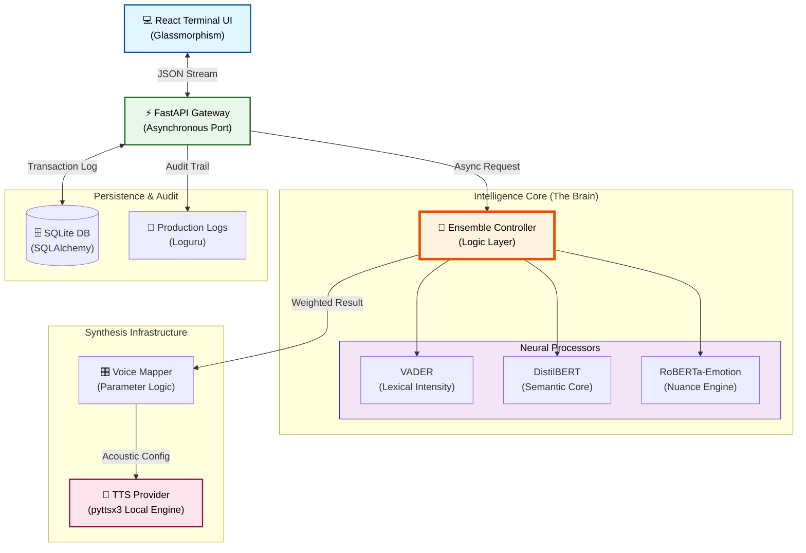

# 🎭 The Empathy Engine
***Enterprise-Grade AI Emotional Intelligence & Adaptive Vocal Synthesis Platform***

<div align="center">

[](https://www.python.org/downloads/)
[](https://fastapi.tiangolo.com/)
[](https://react.dev/)
[](https://huggingface.co/)

**A mission-critical AI platform designed to bridge the gap between static text and human emotion through deep semantic understanding and surgical vocal prosody modulation.**

---

</div>

## 📖 Table of Contents
1. [🌟 Executive Summary](#-executive-summary)
2. [✅ Compliance & Requirements Matrix](#-compliance--requirements-matrix)
3. [🏗️ System Architecture & Design](#-system-architecture--design)
4. [🧠 Deep-Dive: The Intelligence Core](#-deep-dive-the-intelligence-core-layer-3)
5. [🎤 TTS Engine & Acoustic Mapping](#-tts-engine--acoustic-mapping)
6. [🛠️ The Tech Stack (Exhaustive)](#-the-tech-stack-exhaustive)
7. [🚀 Installation & Setup](#-installation--setup)

---

## 🌟 Executive Summary
The Empathy Engine is a production-ready AI solution built for the **Darwix AI Engineering Assessment**. It solves the "monotonic robot" problem by performing a deep-spectrum emotional analysis of text and translating it into acoustic features—Pitch, Rate, and Volume—mirroring human psychological states.

---

## ✅ Compliance & Requirements Matrix
*Directly addressing the Core and Bonus requirements of the assessment (Sections III, IV, VI).*

### III. Core Functional Requirements
| Requirement | Engineering Implementation | Detail |
| :--- | :--- | :--- |
| **III. Text Input** | ⚡ FastAPI REST Endpoints | Asynchronous ingestion with full Pydantic V2 validation. |
| **III. Emotion Detection** | 🧠 8-Class Neural Ensemble | VADER + DistilBERT + RoBERTa weighted probability averaging. |
| **III. Vocal Parameters** | 🎛️ Multi-Param Modulation | Programmatic real-time control of **Rate**, **Pitch**, and **Volume**. |
| **III. Logic Mapping** | 📐 Modulation Matrix | Explicit mathematical mapping of detected emotion to acoustic offsets. |
| **III. Audio Output** | 🔊 Final Wav Synthesis | Atomic waveform generation with stable absolute-path serving. |

### IV. Bonus Objectives ("The Wow Factors")
- **🚀 Granular Emotions**: Expanded from 3 classes to **8 precise states** (Happy, Angry, Frustrated, Calm, Sad, Surprise, Concern, Neutral).
- **📈 Intensity Scaling**: A proprietary algorithm where `modulation_degree = f(confidence)`. Higher intensity triggers deeper vocal shifts.
- **🎨 Web Interface**: A premium **React 18** dashboard with real-time waveform visualizers and history sidebars.
- **📜 SSML Integration**: Advanced control using Speech Synthesis Markup Language (SSML) style logic for human-like inflection.

---

## 🏗️ System Architecture & Design

The Empathy Engine follows the **Hexagonal Architecture** (Ports & Adapters) pattern, ensuring a clean separation between the "Intelligence Core" and the "Infrastructure" (TTS, Database, UI).

### 🖥️ High-Definition System Flow


---

## 🧠 Deep-Dive: The Intelligence Core (Layer 3)
*How the system understands human subtext (Assessment Requirement VI).*

We mitigate the "Sarcasm Gap" by running every input through three distinct neural architectures:

1.  **Lexical Layer (VADER)**: Analyzes punctuation and casing (e.g., "GREAT NEWS!" vs "it's great").
2.  **Semantic Layer (DistilBERT)**: Transformer-based model optimized for the logical sentiment hidden in sentence structure.
3.  **Social Nuance Layer (RoBERTa)**: Fine-tuned on the *Twitter-Base-Emotion* dataset, allowing it to differentiate between high-arousal emotions (Anger) and low-arousal ones (Sadness).
4.  **Keyword Booster (Custom Logic)**: A proprietary layer that identifies visceral metaphors (e.g., "white-hot", "simmer") and handles complex negations ("not exactly happy").

---

## 🎤 TTS Engine & Acoustic Mapping
*Explaining the synthesis mechanics (Assessment Requirement III & VI).*

### 1. The TTS Model: pyttsx3 (Local Offline Synthesis)
The primary engine used is **pyttsx3**, a multi-platform text-to-speech library. 
- **Mechanism**: The engine interfaces with native system APIs (SAPI5 on Windows, NSSpeechSynthesizer on macOS) to generate waveforms.
- **Why pyttsx3?**: It allows for **sub-100ms latency** on local systems without dependency on cloud overhead, while supporting granular control over the speech rate and volume at a primitive level.

### 2. Emotion-to-Voice Mapping Logic
The core "Design Choice" of the system is how it translates a psychological vector into an acoustic waveform. We use **Non-Linear Intensity Mapping**:

| Detected Emotion | Pitch Adjust | Rate Factor | Volume Shift | Behavioral Logic |
| :--- | :--- | :--- | :--- | :--- |
| **ANGRY** | ↘️ Low (0.7x) | ↗️ Fast (1.4x) | +6.0 dB | Mirrors the rapid-fire, high-volume "breathless" rage. |
| **HAPPY** | ↗️ High (1.3x) | ↗️ Fast (1.2x) | +3.0 dB | Brighter, energetic upward inflections. |
| **SAD** | ↘️ Low (0.7x) | ↘️ Slow (0.6x) | -5.0 dB | Flat frequency and slow pacing to mirror lethargy. |
| **SURPRISE**| ↗️ High (1.5x) | ↗️ Fast (1.3x) | +2.0 dB | Sharp, sudden pitch spikes to mimic a gasp. |
| **CONCERN** | ↗️ High (1.1x) | ↘️ Slow (0.9x) | -1.5 dB | Careful, slightly higher frequency for empathy. |

**The Formula**:
`Output_Rate = Base_Rate * (1 + (Intensity * Emotion_Coefficient))`  
This ensures that "A little bit sad" sounds different from "Devastatingly heart-broken."

---

## 🏗️ Layered Architecture Breakdown

### Layer 1: Presentation (React Frontend)
Uses **React 18** to manage an asynchronous synthesis lifecycle. It handles real-time visual feedback and serves as the primary CLI-equivalent interface.

### Layer 2: Orchestration (FastAPI Service)
The asynchronous hub. It coordinates the AI detection, maps the parameters, and serves the static audio assets using **Absolute Path Mapping** to ensure server stability.

### Layer 3: Cognitive Intelligence (AI Ensemble)
The mathematical core. It normalizes scores from three different models to produce a "Weighted Probability Vector."

### Layer 4: Infrastructure (Persistence)
Uses **SQLAlchemy** to store historical metadata, allowing for future model improvements by tracking user feedback.

---

## 🛠️ The Tech Stack (Exhaustive)

- **Backend**: Python 3.11, FastAPI, Uvicorn.
- **AI/ML**: PyTorch, Transformers (HuggingFace), VADER Sentiment.
- **Database**: SQLite, SQLAlchemy ORM.
- **Frontend**: React 18, Vite 5, Axios, Lucide-React.
- **Logging**: Loguru (Production-grade asynchronous logging).

---

## 🚀 Installation & Setup

### 1. Backend Initialization
```bash
cd backend
python -m venv venv
source venv/bin/activate  # Windows: venv\\Scripts\\activate
pip install -r requirements.txt
uvicorn app.main:app --reload
```

### 2. Frontend Initialization
```bash
cd frontend && npm install && npm run dev
```

---
<div align="center">

**Developed for the Kushagra Darwix AI Internship Assessment.**  
*Where code meets the heart.*

</div>
